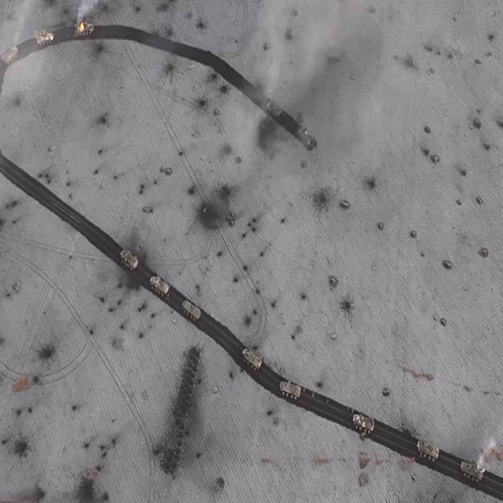
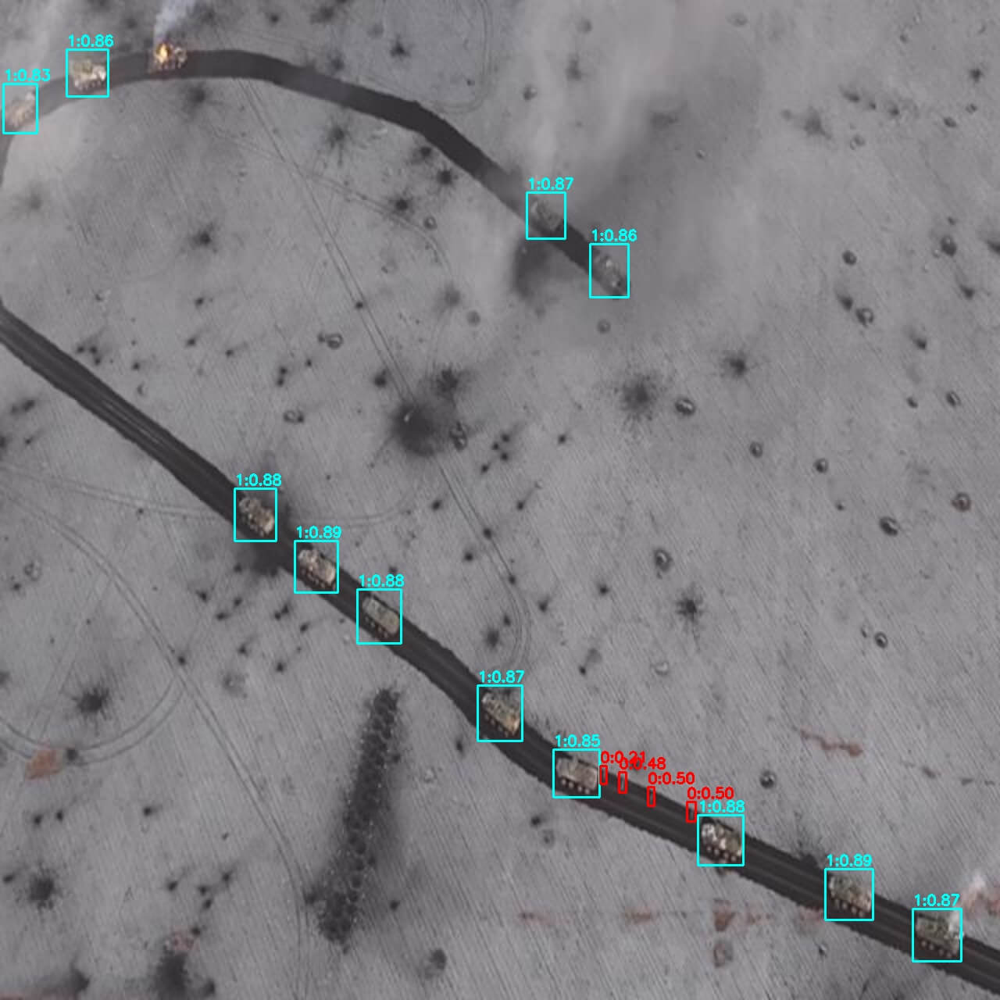

# PyTRT (TRT inference in python from ONNX)

###### &emsp;&emsp;&emsp;&emsp;&emsp;&emsp;&emsp;&emsp; - by [Mykyta Kyselov (TheMegistone4Ever)](https://github.com/TheMegistone4Ever).

PyTRT is a high-performance Python application for object detection, leveraging NVIDIA TensorRT for accelerated
inference. This project provides a complete pipeline, from converting a pre-trained YOLO model in ONNX format to a
highly optimized TensorRT engine, to performing real-time inference on images.

The example provided demonstrates the detection of military vehicles in a satellite image.

| Original Image                        | Detections                             |
|---------------------------------------|----------------------------------------|
|  |  |

## Table of Contents

- [1. Getting Started](#1-getting-started)
    - [1.1. Project Overview](#11-project-overview)
    - [1.2. Features](#12-features)
    - [1.3. Prerequisites](#13-prerequisites)
    - [1.4. Installation](#14-installation)
- [2. Usage](#2-usage)
    - [2.1. Model Conversion](#21-model-conversion)
    - [2.2. Running Inference](#22-running-inference)
- [3. Project Structure](#3-project-structure)
- [4. Configuration](#4-configuration)
- [5. License](#5-license)

## 1. Getting Started

### 1.1. Project Overview

This repository contains Python scripts to serialize an ONNX model into a TensorRT engine and then use that engine for
fast object detection inference. The post-processing steps, including Non-Maximum Suppression (NMS), are implemented to
refine the raw output from the model.

### 1.2. Features

- **ONNX to TensorRT Conversion**: Script to convert ONNX models into optimized TensorRT engines.
- **High-Performance Inference**: Utilizes TensorRT and `cupy` for GPU-accelerated inference.
- **YOLO Post-Processing**: Includes utilities for handling YOLO model output, such as confidence filtering and
  Non-Maximum Suppression (NMS).
- **Clear & Modular Code**: The project is organized into logical modules for configuration, utilities, and main
  application logic.

### 1.3. Prerequisites

Before you begin, ensure you have the following installed:

- An NVIDIA GPU
- NVIDIA Driver
- CUDA Toolkit (the required `cupy` version `cupy-cuda13x` suggests CUDA 12.x or newer)
- NVIDIA cuDNN
- Python 3.8+

### 1.4. Installation

1. **Clone the repository:**
   ```bash
   git clone https://github.com/TheMegistone4Ever/PyTRT.git
   cd PyTRT
   ```

2. **Install the required Python packages:**

   Before installing the Python packages, it is crucial to set up the underlying development environment, especially on
   Windows. These packages rely on NVIDIA's CUDA platform and a C++ compiler to function correctly.

   <br>

   **System Prerequisites (Windows)**

    * **NVIDIA CUDA Toolkit**: This is essential for running code on an NVIDIA GPU. The `cupy-cuda13x` package in
      `requirements.txt` is built for CUDA 12.x. You must install a compatible version of the CUDA Toolkit from
      the [NVIDIA Developer website](https://developer.nvidia.com/cuda-toolkit). During installation, ensure that the
      CUDA paths (e.g., `C:\Program Files\NVIDIA GPU Computing Toolkit\CUDA\v12.x\bin` and
      `C:\Program Files\NVIDIA GPU Computing Toolkit\CUDA\v12.x\libnvvp`) are added to your system's `PATH` environment
      variable.

    * **Microsoft C++ Build Tools**: Many Python libraries, including `cupy`, need to compile C++ code during
      installation. You can install these tools using the Visual Studio Installer.
        1. Download the [Visual Studio Installer](https://visualstudio.microsoft.com/downloads/).
        2. Run the installer and on the "Workloads" tab, select **"Desktop development with C++"**.
        3. Complete the installation.

    * **NVIDIA cuDNN (Optional but Recommended)**: For a significant performance boost in deep learning tasks, it is
      highly recommended to install the NVIDIA CUDA Deep Neural Network library (cuDNN). You can download it from
      the [NVIDIA Developer website](https://developer.nvidia.com/cudnn) (requires a free developer account).
      Installation typically involves copying the cuDNN `.dll`, `.h`, and `.lib` files into the corresponding `bin`,
      `include`, and `lib` directories within your CUDA Toolkit installation folder.

   <br>

   Once the prerequisites are installed, you can proceed with installing the Python packages.

   ```bash
   pip install -r requirements.txt
   ```

3. **Provide a model:**
   This project requires a pre-trained YOLO model in the ONNX format. Place your model in the root directory and name it
   `best.onnx`. Note that `.onnx` files are ignored by version control as per the `.gitignore` file.

## 2. Usage

### 2.1. Model Conversion

First, you must convert the `.onnx` model into a TensorRT engine file (`.engine`). This step optimizes the model for
your specific GPU architecture.

Run the `serialize.py` script:

```bash
python serialize.py
```

This will generate a `best.engine` file in the project's root directory.

### 2.2. Running Inference

Once the TensorRT engine is created, you can run inference on an image.

1. Place your input image in the root directory (e.g., `test_0279.jpg`).
2. Update the `image_in = cv2.imread("test_0279.jpg")` line in `main.py` if your image has a different name.
3. Execute the main script:
   ```bash
   python main.py
   ```

The script will display the image with detection boxes drawn on it and save the result as `detections_out.jpg`.

## 3. Project Structure

```
.
├── .gitattributes      # Specifies Git attributes for handling file types
├── .gitignore          # Lists files and directories for Git to ignore
├── config.py           # Configuration variables (input size, pixel values)
├── detections_out.jpg  # Example output image with detections
├── LICENSE.md          # Project license
├── main.py             # Main script to run inference
├── README.md           # This README file
├── requirements.txt    # Python dependencies
├── serialize.py        # Script to convert ONNX to TensorRT engine
├── test_0279.jpg       # Example input image
└── yolo_utils.py       # Utility functions for YOLO post-processing (NMS, drawing boxes)
```

## 4. Configuration

Key parameters can be adjusted in the `config.py` file:

- `INPUT_SIZE`: The input image resolution expected by the model (e.g., 640 for 640x640).
- `MAX_VALUE_PIX`: The maximum pixel value for image normalization (typically 255.0).

Inference and visualization parameters (confidence threshold, IOU threshold, etc.) can be modified directly in the
`main.py` and `yolo_utils.py` files.

## 5. License

The project is licensed under the [CC BY-NC 4.0 License](LICENSE.md).